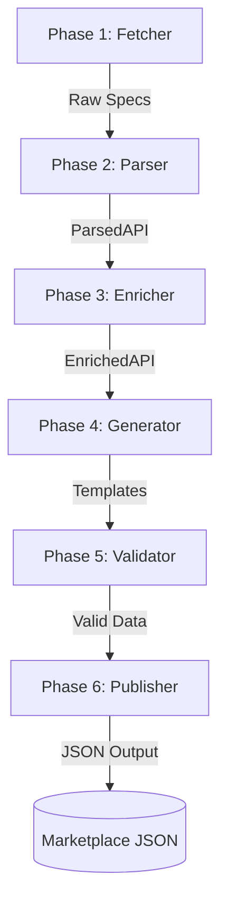

# API Dash Marketplace Pipeline

Automated pipeline for processing, enriching, and publishing API specifications to the [API Dash](https://github.com/foss42/apidash) Marketplace.

## What this is

This repository contains the backend infrastructure for the API Marketplace. It fetches thousands of API specifications from the `apis.guru` catalog (and manual sources), parses them into a standardized format, enriches them with branding and authentication metadata, generates ready-to-use request templates, and validates them for security and correctness. The output is a set of static JSON files served via GitHub Pages to the API Dash client.

## How it works

The pipeline operates in 6 distinct phases:



1.  **Fetcher**: Downloads updated specs and diffs against a local snapshot to avoid redundant processing.
2.  **Parser**: Converts OpenAPI 2/3 and HTML documentation into a clean, intermediate Python model.
3.  **Enricher**: Detects auth types, maps categories, and identifies provider logos.
4.  **Generator**: Builds functional request templates (URL, headers, body) with placeholders.
5.  **Validator**: Scans for accidental secrets and ensures compliance with the Marketplace schema.
6.  **Publisher**: Writes the final `index.json` and per-API `templates.json` files.

## Folder Structure

```text
apidash-marketplace/
├── .github/workflows/    # Automated nightly sync
├── config/               # Logic configuration (category maps, schema)
├── marketplace/          # GENERATED: Final JSON output (Git-tracked)
├── pipeline/             # Python source code for all phases
│   ├── run.py            # Main Orchestrator
│   └── ...               # Individual phase modules
├── raw/                  # DOWNLOADED: Temporary raw specs (Git-ignored)
├── sources.yaml          # Manual API entries
└── README.md             # You are here
```

## Running Locally

### 1. Prerequisites
- Python 3.11 or higher
- Git

### 2. Setup
```bash
# Clone the repository
git clone https://github.com/your-username/apidash-marketplace.git
cd apidash-marketplace

# Create and activate virtual environment
python -m venv venv
source venv/bin/activate  # Windows: venv\Scripts\activate

# Install dependencies
pip install -r pipeline/requirements.txt
```

### 3. Execution
```bash
# Full Dry Run (test everything without writing to marketplace/)
python pipeline/run.py --dry-run

# Process a specific API (e.g. Stripe)
python pipeline/run.py --api-id stripe.com

# Force reprocess everything
python pipeline/run.py --force-all
```

## Adding a New API Manually

To add an API not present in the APIs Guru catalog, append it to `sources.yaml`:

```yaml
sources:
  - id: my-awesome-api
    name: My Awesome API
    spec_url: https://docs.example.com/openapi.json
    type: openapi
    category: Tools
```

## Community Contributions

We welcome contributions to improve templates or add new APIs!
1.  **Improve Templates**: Edit the logic in `pipeline/template_generator.py`.
2.  **Fix Mappings**: Update `config/category_map.yaml`.
3.  **Add APIs**: Open a PR adding your API to `sources.yaml`.

## GitHub Actions

The pipeline runs automatically every night at **2:00 AM UTC**. 
- You can manually trigger it via the **Actions** tab in GitHub.
- Use the `api_id` parameter to re-sync a specific API immediately.
- The `[skip ci]` tag in commit messages prevents infinite loops of sync runs.

## Output Format

The marketplace produces two main types of files:
- `index.json`: A directory of all available APIs.
- `apis/{api_id}/templates.json`: Detailed request templates for a specific API.

## License
This project is licensed under the Apache 2.0 License.
